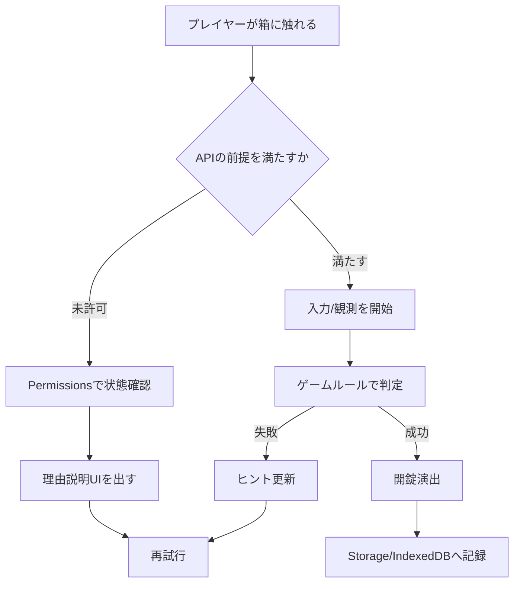

# 添付Deep Researchメモ（保存版）

> 2026-07-15に受領した `deep-research-report.md` の内容スナップショット。
> Markdownの改行用行末空白は ` ` へ正規化している。
> これはギミックのアイデア源であり、仕様・互換性・採用判断の根拠ではない。
> 原文中の引用マーカーはこのリポジトリから解決できないため、採用前に公式一次資料で再調査する。

---

# Busybox向けWeb APIギミック総覧

## エグゼクティブサマリ

本レポートは、MDN の「Web API」索引を基準集合として、同索引に掲載された API 仕様書ページを起点に Busybox 向けの箱開錠ギミックへ割り当てたブレインストーミング集である。日本語索引と英語索引の重複項目は統合し、同一 API には最低 1 案ずつ付与した。 citeturn1view0turn5view0turn6view0

結論として、Busybox と相性がもっとも良いのは、入力系では Keyboard / Pointer / Gamepad / Geolocation、演出系では Web Audio / Canvas / View Transitions / Web Animations、継続運用系では Service Worker / IndexedDB / Storage / Push / Notifications / Background Sync である。これらはゲーム体験に直結しやすく、権限・互換性・実装コストのバランスも比較的取りやすい。 citeturn5view0turn7view0turn10view0turn9view3turn9view4turn11view4

一方、Web Serial / WebUSB / WebHID / Web Bluetooth / Web NFC / Local Font Access / Idle Detection などの周辺機器・OS 連携系は、ギミックとして非常に強いが、対応ブラウザや実行条件に制約が大きい。これらは「特別ステージ」「展示向け」「開発者向け隠し箱」に寄せるのが現実的である。 citeturn9view0turn13view2turn13view3turn13view4turn13view5turn13view14

設計方針としては、各 API を単発のネタとして扱うより、「観測」「判定」「演出」「永続化」「再挑戦導線」の 5 層で組み合わせると Busybox らしい閉箱ギミックにしやすい。特に Permissions API と Storage / IndexedDB を前段に置くと、権限依存 API の UX が安定する。 citeturn9view4turn11view4turn5view0

## 調査基準とカテゴリ俯瞰

本レポートでは、MDN の Web API 索引に載っている API を「入力・感知」「描画・DOM・表示」「メディア・XR」「ストレージ・オフライン・通信」「認証・権限・外部機器」に再編した。各 API について、箱が開く条件を 1 つの明確なゲームルールへ落とし、必要なら複数 API 連携を前提にした。なお、MDN 側で限定的・実験的・ secure context 前提とされる API は、その旨を注意点に反映した。 citeturn1view0turn5view0turn6view0turn8view0turn9view0turn9view1turn9view3turn12view0turn13view2turn13view3turn13view5

| カテゴリ | Busyboxでの主な役割 | 代表 API | 典型ギミック | 実装リスク |
|---|---|---|---|---|
| 入力・感知 | 物理操作や状態変化を開錠条件にする | Geolocation, Keyboard, Pointer Events, Gamepad, Sensor APIs | 振る・傾ける・押す・向ける・近づく | 権限、端末差、デスクトップ非対応 |
| 描画・DOM・表示 | 箱自体の見た目やヒントの提示 | DOM, HTML DOM API, Canvas, CSSOM, View Transitions, SVG | 箱面が変形、文字が浮かぶ、視差で暗号表示 | 表現実装量が増えやすい |
| メディア・XR | 音・映像・カメラ・空間を鍵にする | Web Audio, Screen Capture, Media Capture, WebXR, WebCodecs | 声で唱える、映像に一致、ARで鍵穴出現 | 権限、CPU/GPU負荷、互換性 |
| ストレージ・オフライン・通信 | 進行管理、非同期課題、継続プレイ | IndexedDB, Storage, Service Worker, Push, Fetch | 数日後に再開く箱、オフラインで育つ箱 | PWA前提、複数スレッド理解が必要 |
| 認証・権限・外部機器 | 現実世界の証明を鍵にする | WebAuthn, Web Share, WebUSB, WebHID, Web NFC | 実機接続で開く、本人確認で開く | 権限・安全文脈・対応ブラウザ差 |
| 観測・最適化 | 難易度調整や裏条件に使う | Performance, Reporting, Device Memory, Compute Pressure | 低負荷でだけ開く、操作精度で開く | 可搬性より分析寄り |

## 入力・感知系のギミック集

**位置情報 API** — 現在地を取得する API。 
操作手順: 地図上の「見えない鍵穴」へ移動する。成功条件: `navigator.geolocation` で取得した座標が目標半径内。UX/演出: 箱の表面がコンパス化し、近づくほど鼓動音が速くなる。注意点: HTTPS とユーザー許可が前提。難易度: 中。優先度: 高。擬似コード: `getCurrentPosition(({coords})=>inZone(coords)&&unlock())`。参考: MDN 位置情報 API。 citeturn7view0

**インク API** — ペン・インクの低遅延描画系 API。 
操作手順: 箱面に決められた一筆書き記号を書く。成功条件: ストローク形状がテンプレートと一致。UX/演出: ペン先の軌跡が実物のインクのように残り、正答時だけ封印紋が発光。注意点: 対応端末前提。難易度: 中。優先度: 中。擬似コード: `inkTrail.match(sigil)&&unlock()`。参考: MDN 索引の Ink API。 citeturn5view0

**センサー API 群** — 加速度・ジャイロ・磁気・照度などの総称。 
操作手順: 振る、静止させる、明るい場所へ向ける、北へ向ける。成功条件: 指定センサー値の閾値を順番通り達成。UX/演出: 箱内部の錘が動く、羅針盤が揃う。注意点: モバイル依存が強い。難易度: 中。優先度: 高。擬似コード: `readSensors().matches(pattern)&&unlock()`。参考: MDN Sensor APIs。 citeturn5view0

**端末方向イベント** — 端末の向きや動きを検出するイベント。 
操作手順: 端末を「左→上→右→下」に傾ける。成功条件: 方向シーケンス一致。UX/演出: 箱の中の液体が傾きに合わせて流れる。注意点: HTTPS 前提。難易度: 低。優先度: 高。擬似コード: `sequence.push(dir); if(match(sequence)) unlock()`。参考: MDN 端末方向イベント。 citeturn13view8

**端末形態 API** — 折りたたみ/ヒンジ状態などを扱う API。 
操作手順: 端末を半開き・全開きなど指定姿勢にする。成功条件: posture 条件一致。UX/演出: 箱が画面のヒンジ位置で二分され、姿勢で封印が割れる。注意点: 対応端末が限定的。難易度: 中。優先度: 低。擬似コード: `if(devicePosture==="folded") unlock()`。参考: MDN 索引の Device Posture API。 citeturn5view0

**ゲームパッド API** — ゲームパッド入力と状態取得。 
操作手順: 隠されたコマンド入力を行う。成功条件: ボタン/スティック列が一致。UX/演出: 箱に隠し端子が現れ、アーケード機の自己診断風 UI が出る。注意点: パッド接続が必要。難易度: 低。優先度: 高。擬似コード: `readPad().combo===secret && unlock()`。参考: MDN Gamepad API。 citeturn12view2turn5view0

**入力機器能力 API** — 入力元がタッチ/マウス等かをより詳しく扱う API。 
操作手順: 「この箱は指でしか開かない」「マウスでなぞると逆に閉じる」を実装する。成功条件: 想定入力機器で正しい操作を完了。UX/演出: 指だと柔らかい面、マウスだと針金のような面に見える。注意点: 補助的 API。難易度: 低。優先度: 中。擬似コード: `if(ev.sourceCapabilities.firesTouchEvents) progress++`。参考: MDN 索引の Input Device Capabilities API。 citeturn5view0

**キーボード API** — 物理キー配列やキー名の扱い。 
操作手順: 物理キー位置ベースの暗号を打つ。成功条件: レイアウト差を吸収した上で正しい物理キー列。UX/演出: 箱がタイプライターへ変形する。注意点: レイアウト差に配慮。難易度: 低。優先度: 高。擬似コード: `keyboard.getLayoutMap().then(map=>matchPhysical(map)&&unlock())`。参考: MDN Keyboard API。 citeturn5view0

**タッチイベント** — マルチタッチ操作。 
操作手順: 箱に 3 本指で押さえながら 1 本指で回す。成功条件: 指数・移動量・時間が一致。UX/演出: 指紋が箱面に残り、ロゼット状に広がる。注意点: Pointer Events との使い分け検討。難易度: 低。優先度: 高。擬似コード: `if(touches.length===3 && rotateOk) unlock()`。参考: MDN Touch Events。 citeturn5view0

**ポインターイベント** — マウス/ペン/タッチを統一的に扱うイベント。 
操作手順: 押圧・筆圧・傾き差を含むストロークでルーンを描く。成功条件: pointerType と pressure/tilt の組み合わせ一致。UX/演出: ペンだと線が鋭く、指だとにじむ。注意点: 互換性は比較的良い。難易度: 低。優先度: 高。擬似コード: `if(ev.pressure>.7 && pathOk) unlock()`。参考: MDN Pointer Events。 citeturn5view0

**ポインターロック API** — 相対移動だけを受け取る没入入力。 
操作手順: 視点を固定して迷路型ダイヤルを操作する。成功条件: 相対移動で内部迷路の中心へ到達。UX/演出: 画面全体が箱の内部になる。注意点: ユーザー操作起点で開始する設計が必要。難易度: 中。優先度: 中。擬似コード: `canvas.requestPointerLock(); yaw+=movementX; if(center) unlock()`。参考: MDN Pointer Lock API。 citeturn12view10turn5view0

**Force Touch events** — 圧力差のような特殊入力イベント。 
操作手順: 触れるだけではなく「押し込む」強さで封印を割る。成功条件: 圧力プロファイルが一致。UX/演出: 箱材がたわみ、限界で亀裂が走る。注意点: 実機依存・採用は低優先。難易度: 中。優先度: 低。擬似コード: `if(forceCurve===secretCurve) unlock()`。参考: MDN 索引の Force Touch events。 citeturn5view0

**UI イベント** — キー・フォーカス・スクロールなど基本 UI イベント群。 
操作手順: スクロール、フォーカス移動、ダブルクリックを規定順に行う。成功条件: UI イベント系列一致。UX/演出: 箱がオフィス文具のような UI で喋る。注意点: 古いイベント系との整理が必要。難易度: 低。優先度: 中。擬似コード: `timeline.push(ev.type); if(match(timeline)) unlock()`。参考: MDN UI Events。 citeturn5view0

**バイブレーション API** — 端末の振動制御。 
操作手順: 箱が返す振動パターンを覚え、そのリズム通りに再入力する。成功条件: 正答リズム入力。UX/演出: 視覚ではなく触覚でヒントが来る。注意点: モバイル寄り。難易度: 低。優先度: 中。擬似コード: `navigator.vibrate([100,50,200]); if(tapRhythmOk) unlock()`。参考: MDN Vibration API。 citeturn5view0

**EyeDropper API** — 画面上の色をスポイト取得。 
操作手順: シーン中から正しい「鍵色」を拾う。成功条件: 取得色が箱の許容色域に入る。UX/演出: 箱の鍵穴が色相環に変わる。注意点: 対応差あり。難易度: 低。優先度: 中。擬似コード: `new EyeDropper().open().then(({sRGBHex})=>matchColor(sRGBHex)&&unlock())`。参考: MDN EyeDropper API。 citeturn12view13

**バーコード検出 API** — バーコード/QR などの検出。 
操作手順: 部屋の中から隠しコードをカメラで見つける。成功条件: `BarcodeDetector` が特定値を返す。UX/演出: 箱面にスキャンラインが走る。注意点: カメラ併用前提。難易度: 低。優先度: 中。擬似コード: `detect(frame).includes(secret)&&unlock()`。参考: MDN 索引の Barcode Detection API。 citeturn5view0

**連絡先ピッカー API** — 連絡先選択。 
操作手順: 「箱の持ち主」をアドレス帳から見つける。成功条件: 選ばれた連絡先がヒント条件に一致。UX/演出: 宛名ラベルが本当に封筒のように貼り付く。注意点: 個人情報・権限説明が重要。難易度: 中。優先度: 低。擬似コード: `contacts.select(['name']).then(cs=>isOwner(cs[0])&&unlock())`。参考: MDN Contact Picker API。 citeturn12view14turn5view0

**Idle Detection API** — ユーザー/画面のアイドル状態検出。 
操作手順: 一定時間まったく触らず「待つ」。成功条件: idle 状態がしきい値超え。UX/演出: 箱が静けさを食べて開く。注意点: 権限・対応差あり。難易度: 低。優先度: 低。擬似コード: `idleDetector.start(); if(state==="idle") unlock()`。参考: MDN Idle Detection API。 citeturn12view15turn5view0

**User Preferences API** — ユーザー環境設定に応じた取得。 
操作手順: ダーク/ライトや reduced motion 等、環境設定を箱の正解にする。成功条件: ユーザー設定と箱の要求が一致。UX/演出: 箱が「あなた仕様」で応答する。注意点: 変更不能な環境もある。難易度: 低。優先度: 低。擬似コード: `matchMedia('(prefers-color-scheme: dark)').matches&&unlock()`。参考: MDN 索引の User Preferences API。 citeturn5view0

**VirtualKeyboard API** — 仮想キーボード制御。 
操作手順: ソフトキーボードの出現で箱の内部レイヤをスライドさせ、特定位置で決定する。成功条件: キーボード表示時のレイアウトで正しい入力。UX/演出: 箱の蓋がキーボードに押されて持ち上がる。注意点: モバイル向け。難易度: 中。優先度: 低。擬似コード: `virtualKeyboard.overlaysContent=true; if(layoutOk) unlock()`。参考: MDN 索引の VirtualKeyboard API。 citeturn6view0

**端末メモリー API** — おおまかなメモリ量ヒント。 
操作手順: 「軽量モードの箱」「豪華モードの箱」に分岐する。成功条件: 端末クラスごとの別鍵を解く。UX/演出: 箱が端末性能に応じて姿を変える。注意点: 直接の謎より適応難易度向き。難易度: 低。優先度: 低。擬似コード: `if(navigator.deviceMemory>=8) useHardVariant()`。参考: MDN 索引の Device Memory API。 citeturn5view0

**バッテリー状態 API** — 充電状態や残量を知る API。 
操作手順: 充電中のときだけ通電する箱を開ける。成功条件: `charging` や残量条件一致。UX/演出: 箱のコイルが電気で光る。注意点: ブラウザ差が大きい。難易度: 低。優先度: 低。擬似コード: `battery.charging && unlock()`。参考: MDN 索引の Battery Status API。 citeturn5view0

**Compute Pressure API** — CPU 負荷級の圧力観測。 
操作手順: 箱が「静かな計算状態」でのみ開くため、他の箱を止めてから挑む。成功条件: pressure が所定以下。UX/演出: 箱の放熱フィンが閉じていく。注意点: 実験的で難度高。難易度: 高。優先度: 低。擬似コード: `pressure.observe(r=>r.state==='nominal'&&unlock())`。参考: MDN 索引の Compute Pressure API。 citeturn5view0

## 表示・描画・DOM系のギミック集

**DOM** — 文書ツリーを操作する中核 API。 
操作手順: 箱内部をノード木として見立て、正しい順序で要素を配置する。成功条件: DOM 構造が正解木と一致。UX/演出: 箱が組木のように再構成される。注意点: もっとも基本的で応用範囲が広い。難易度: 低。優先度: 高。擬似コード: `if(compareTree(document.body,answerTree)) unlock()`。参考: MDN DOM。 citeturn5view0

**HTML DOM API** — HTML 要素固有の振る舞い。 
操作手順: `
`, `<dialog>`, `<input>` などを鍵機構として使用。成功条件: 要素の状態組み合わせが一致。UX/演出: 箱そのものがフォーム化する。注意点: 実装容易。難易度: 低。優先度: 高。擬似コード: `if(dialog.open && meter.value===42) unlock()`。参考: MDN HTML DOM API。 citeturn7view2

**Canvas API** — ラスタ描画 API。 
操作手順: 透かし座標を描き足して絵を完成させる。成功条件: 描画結果のピクセル差分が閾値内。UX/演出: 箱面が絵筆で塗られ、完成時に鍵穴が出る。注意点: 判定方法設計が重要。難易度: 中。優先度: 高。擬似コード: `ctx.lineTo(...); if(similar(canvas,answer)) unlock()`。参考: MDN Canvas API。 citeturn5view0

**SVG API** — ベクタ図形と属性操作。 
操作手順: ベクタ部品をドラッグして紋章を組み上げる。成功条件: パス・変形・属性が正解。UX/演出: 線が生き物のように動く。注意点: 座標変換設計が要点。難易度: 中。優先度: 高。擬似コード: `svgNode.setAttribute('transform',t); if(matchGlyph()) unlock()`。参考: MDN SVG API。 citeturn5view0

**CSS カウンタースタイル** — 独自番号表現。 
操作手順: 箱の目盛りが普通の数字ではなく独自記数法で表示される。成功条件: 記数法を解読して正しい番号を入力。UX/演出: 異文明の数字を読む感覚。注意点: 表示演出寄り。難易度: 低。優先度: 低。擬似コード: `@counter-style rune { ... }`。参考: MDN CSS Counter Styles。 citeturn5view0

**CSS カスタムハイライト API** — テキスト範囲強調。 
操作手順: 詩や暗号文の一部だけがハイライトされ、その並びを読む。成功条件: ハイライト範囲から導いた鍵文入力。UX/演出: 箱の表面にだけ蛍光線が走る。注意点: テキスト謎に向く。難易度: 低。優先度: 中。擬似コード: `CSS.highlights.set('hint',h);`。参考: MDN CSS Custom Highlight API。 citeturn5view0

**CSS フォント読み込み API** — フォントの動的読み込みと状態監視。 
操作手順: 正しいフォントがロードされたときだけ可読になる暗号を読む。成功条件: 対象フォント読込完了後に答える。UX/演出: 箱の刻印が別書体へ相転移。注意点: フォント配信待ち管理。難易度: 低。優先度: 中。擬似コード: `document.fonts.load('16px Secret').then(showHint)`。参考: MDN 索引の CSS Font Loading API。 citeturn5view0

**CSS 描画 API** — ペイントワークレットで塗り。 
操作手順: 箱表面のノイズ模様から正しい周波数を見つける。成功条件: CSS カスタムプロパティを正解値へ合わせる。UX/演出: 箱の皮膚が生体模様のように変化。注意点: Houdini 対応前提。難易度: 高。優先度: 低。擬似コード: `element.style.setProperty('--seed',42)`。参考: MDN 索引の CSS Painting API。 citeturn5view0

**CSS プロパティと値 API** — カスタムプロパティを型付き登録。 
操作手順: 箱の温度/角度のような仮想値を UI で精密調整。成功条件: 型付きカスタムプロパティが閾値一致。UX/演出: ダイヤルが数式的に変形。注意点: CSS 主導設計に向く。難易度: 中。優先度: 中。擬似コード: `CSS.registerProperty({name:'--angle',syntax:'<angle>'})`。参考: MDN 索引の CSS Properties and Values API。 citeturn5view0

**CSS 型付き OM API** — CSS 値を型付きで扱う API。 
操作手順: 箱の位置・回転を数式操作で微調整する。成功条件: 計算誤差なく姿勢が正解。UX/演出: 精密機械の校正感が出る。注意点: 実装は中〜高。難易度: 中。優先度: 低。擬似コード: `el.attributeStyleMap.set('rotate',CSS.deg(45))`。参考: MDN 索引の CSS Typed OM API。 citeturn5view0

**CSSOM** — スタイルシートと CSS ルールの操作。 
操作手順: 箱のスタイルルールを組み替えて正しい見た目にする。成功条件: CSSRule の組が答え状態。UX/演出: 実験室の配線盤のように見える。注意点: 開発者向け謎に向く。難易度: 中。優先度: 中。擬似コード: `sheet.insertRule(secretRule)`。参考: MDN 索引の CSSOM。 citeturn5view0

**CSSOM ビュー API** — 画面位置・サイズ・スクロールを扱う API。 
操作手順: スクロール位置や要素のビューポート位置を鍵にする。成功条件: 箱の鍵穴が画面中央ぴったりに来る。UX/演出: 画面そのものが測定器になる。注意点: レイアウト差に注意。難易度: 低。優先度: 高。擬似コード: `if(el.getBoundingClientRect().left===target) unlock()`。参考: MDN 索引の CSSOM View API。 citeturn5view0

**幾何インターフェイス** — 点・行列・矩形など幾何型。 
操作手順: レンズや反射のシミュレーションを几何学で解く。成功条件: DOMPoint/DOMMatrix 計算で光線が鍵穴へ到達。UX/演出: 数学的で美しい。注意点: 補助 API として使う。難易度: 中。優先度: 中。擬似コード: `ray = matrix.transformPoint(p); if(hitLock(ray)) unlock()`。参考: MDN Geometry interfaces。 citeturn5view0

**交差オブザーバー API** — 要素可視交差の監視。 
操作手順: いくつかの窓穴を重ね、特定の位置でだけシンボルが重なる。成功条件: 複数ターゲットの交差率が閾値超え。UX/演出: のぞき穴を合わせるアナログ感。注意点: スクロール謎と相性が良い。難易度: 低。優先度: 高。擬似コード: `observer.observe(lockSlot)`。参考: MDN Intersection Observer API。 citeturn5view0

**リサイズオブザーバー API** — 要素サイズ変化監視。 
操作手順: ブラウザ幅や箱サイズを変えて正しい寸法へ合わせる。成功条件: 目標サイズ到達。UX/演出: 箱が伸縮しながら噛み合う。注意点: レスポンシブ前提。難易度: 低。優先度: 中。擬似コード: `new ResizeObserver(([e])=>e.contentRect.width===512&&unlock())`。参考: MDN Resize Observer API。 citeturn5view0

**Selection API** — テキスト選択制御。 
操作手順: 文中の離れた単語を順に選択して暗号を作る。成功条件: 選択範囲の順序が正解。UX/演出: 選択箇所が封印線としてつながる。注意点: テキスト UX に向く。難易度: 低。優先度: 中。擬似コード: `getSelection().toString()===answer && unlock()`。参考: MDN Selection API。 citeturn5view0

**全画面 API** — 要素をフルスクリーン表示。 
操作手順: 全画面化すると初めて揃う視差絵を読む。成功条件: fullscreen 状態で正しい入力。UX/演出: 箱に飲み込まれる没入感。注意点: ユーザー操作起点が必要。難易度: 低。優先度: 中。擬似コード: `await box.requestFullscreen(); if(readCode()) unlock()`。参考: MDN Fullscreen API。 citeturn12view1turn5view0

**ポップオーバー API** — 軽量な浮き層 UI。 
操作手順: 小窓を正しい順番に開閉して鍵盤模様を作る。成功条件: popover 状態列が一致。UX/演出: 箱の小蓋がカチカチ開閉する。注意点: 比較的新しい UI 機能。難易度: 低。優先度: 中。擬似コード: `popover.showPopover(); if(stateOk) unlock()`。参考: MDN Popover API。 citeturn5view0

**ビュー遷移 API** — 画面遷移の視覚連続性。 
操作手順: 箱の表裏・断面・内部を連続遷移で見比べ、変化点を当てる。成功条件: 遷移中にだけ現れる記号を入力。UX/演出: 画面が本当に折り畳まれて開く。注意点: 演出価値が高い。難易度: 中。優先度: 高。擬似コード: `document.startViewTransition(()=>swapFace())`。参考: MDN View Transitions API。 citeturn5view0

**ビューポートセグメント API** — 折りたたみ端末などのセグメント情報。 
操作手順: 片画面に鍵、もう片画面にヒントを分ける。成功条件: セグメント跨ぎで正しく揃える。UX/演出: 箱が二つに割れてもまだ一つ。注意点: 対応端末限定。難易度: 中。優先度: 低。擬似コード: `if(viewport.segments.length===2 && alignOk) unlock()`。参考: MDN Viewport Segments API。 citeturn6view0

**Window Management API** — 複数ディスプレイ/ウィンドウ管理。 
操作手順: 2 枚の画面に分かれた箱面を別モニタへ配置する。成功条件: 指定ディスプレイ配置達成。UX/演出: 現実の机を使う巨大箱。注意点: 展示用途向き。難易度: 高。優先度: 低。擬似コード: `getScreenDetails().then(placeWindows)`。参考: MDN Window Management API。 citeturn5view0turn6view0

**Window Controls Overlay API** — インストールアプリのタイトルバー領域活用。 
操作手順: タイトルバーに隠れた鍵を拾う。成功条件: overlay 領域のボタン操作完了。UX/演出: OS 窓枠自体が箱の錠前になる。注意点: PWA 文脈向け。難易度: 中。優先度: 低。擬似コード: `navigator.windowControlsOverlay.visible && unlock()`。参考: MDN Window Controls Overlay API。 citeturn5view0turn6view0

**履歴 API** — セッション履歴の操作。 
操作手順: 戻る・進む・状態遷移の履歴順が鍵。成功条件: ある履歴スタック形へ到達。UX/演出: 時間を巻き戻す箱。注意点: 誤 UX を避ける。難易度: 中。優先度: 中。擬似コード: `history.pushState({k:1},''); if(stackOk) unlock()`。参考: MDN History API。 citeturn5view0

**ナビゲーション API** — 新しい遷移制御 API。 
操作手順: 複数ページ断片をまたいで巡回して箱を開ける。成功条件: 特定の entry sequence 達成。UX/演出: 箱が旅程表のように進む。注意点: 新しめの API。難易度: 中。優先度: 低。擬似コード: `navigation.navigate('/face/2')`。参考: MDN Navigation API。 citeturn5view0

**URL API** — URL の解析・構築。 
操作手順: URL パラメータ自体がダイヤル錠。成功条件: URL の pathname/query/hash を正解に組む。UX/演出: アドレスバーが箱面になる。注意点: 実装容易。難易度: 低。優先度: 高。擬似コード: `const u=new URL(location); if(u.searchParams.get('key')==='42') unlock()`。参考: MDN URL API。 citeturn0search16turn5view0

**URL Fragment Text Directives** — テキスト断片リンク。 
操作手順: 長文のどこを参照すべきか自体を謎にする。成功条件: 正しいテキスト断片へジャンプ。UX/演出: 箱が「この一節だけ読め」と指示する。注意点: 対応差あり。難易度: 低。優先度: 低。擬似コード: `location.hash=':~:text=secret'`。参考: MDN URL Fragment Text Directives。 citeturn5view0

**URL パターン API** — URL マッチング。 
操作手順: 正しいルート構造を推理して辿る。成功条件: URLPattern に一致する遷移完了。UX/演出: 箱が迷路の配線図になる。注意点: ルーティング型謎向け。難易度: 低。優先度: 中。擬似コード: `new URLPattern('/box/:face/:code').test(url)&&unlock()`。参考: MDN URL Pattern API。 citeturn5view0

**ウェブアニメーション API** — DOM/SVG の時間制御アニメーション。 
操作手順: 歯車や封印文字の動きの位相を合わせる。成功条件: 再生時刻/速度が正解状態。UX/演出: 箱の機械感が高い。注意点: 演出にも判定にも使える。難易度: 中。優先度: 高。擬似コード: `anim.currentTime=target; if(aligned) unlock()`。参考: MDN Web Animations API。 citeturn6view0

**ウェブコンポーネント** — 再利用可能な UI 要素群。 
操作手順: 各箱を `<busy-box>` カスタム要素として独立実装する。成功条件: 内部状態マシンが完了。UX/演出: 箱ごとに固有ふるまいを保てる。注意点: 開発基盤向け。難易度: 中。優先度: 高。擬似コード: `customElements.define('busy-box', BusyBox)`。参考: MDN Web Components。 citeturn6view0

**HTML ドラッグ＆ドロップ API** — ドラッグ移動。 
操作手順: 鍵片を箱の正しいスロットへ運ぶ。成功条件: ドロップ対象と順番一致。UX/演出: 物理パズル感が強い。注意点: モバイル補助導線必要。難易度: 低。優先度: 高。擬似コード: `ondrop=e=>matchSlot(e.dataTransfer)&&unlock()`。参考: MDN HTML Drag and Drop API。 citeturn5view0

**HTML 無害化 API** — HTML のサニタイズ。 
操作手順: 汚染された巻物から安全な断片だけを組み立てる。成功条件: sanitize 結果の構造が鍵文。UX/演出: 毒入りの文字を浄化して箱を開く。注意点: 表現より安全処理向き。難易度: 中。優先度: 低。擬似コード: `safe = sanitizer.sanitizeFor('div',html)`。参考: MDN HTML Sanitizer API。 citeturn5view0

**Houdini API** — レイアウト/ペイント/型付き値など低層描画。 
操作手順: 箱面の材質ルール自体を変えて鍵を出現させる。成功条件: worklet 出力が正解状態へ。UX/演出: 箱の“法則”を書き換える感覚。注意点: 実装難度高。難易度: 高。優先度: 低。擬似コード: `CSS.paintWorklet.addModule('box.js')`。参考: MDN Houdini API。 citeturn5view0

**画面方向 API** — 画面の向き制御/取得。 
操作手順: 縦向きと横向きを切り替えながら絵合わせする。成功条件: orientation ごとの断片を統合。UX/演出: 箱の表面が回転で別相になる。注意点: モバイルで相性が良い。難易度: 低。優先度: 中。擬似コード: `screen.orientation.lock('landscape')`。参考: MDN Screen Orientation API。 citeturn5view0

**画面起動ロック API** — 画面消灯を防ぐ。 
操作手順: 一定時間の凝視や待機が必要な箱で使用する。成功条件: 長時間の観測パズルを完遂。UX/演出: 箱の光が絶えず灯る。注意点: HTTPS 前提、長時間ステージで有効。難易度: 低。優先度: 中。擬似コード: `await navigator.wakeLock.request('screen')`。参考: MDN Screen Wake Lock API。 citeturn9view1

**文書ピクチャインピクチャ API** — 任意 HTML を別小窓へ出す。 
操作手順: 本体画面の箱と小窓の箱断片を同時に見る。成功条件: 2 窓の情報を同期して答える。UX/演出: 箱の幽体が別窓に出る。注意点: 対応差あり。難易度: 中。優先度: 低。擬似コード: `documentPictureInPicture.requestWindow()`。参考: MDN Document Picture-in-Picture API。 citeturn5view0

**ピクチャインピクチャ API** — 動画を小窓再生。 
操作手順: メイン画面の箱操作中に小窓映像の合図を読む。成功条件: PiP 映像の合図と本体操作が一致。UX/演出: 防犯カメラ映像を見ながら解錠する感覚。注意点: 対応差あり。難易度: 中。優先度: 低。擬似コード: `video.requestPictureInPicture()`。参考: MDN Picture-in-Picture API。 citeturn12view11turn5view0

**ページ可視性 API** — タブの可視/不可視状態。 
操作手順: タブを離れた “瞬間” にだけ内部機構が進む箱。成功条件: 可視/不可視のパターンを正しく作る。UX/演出: 見ていない間に箱が動く。注意点: 説明不足だと不親切。難易度: 低。優先度: 中。擬似コード: `document.hidden && step++`。参考: MDN Page Visibility API。 citeturn5view0

**EditContext API** — 高度なテキスト編集コンテキスト。 
操作手順: 文字組のブロックを IME 前提で精密に編集し、正しい句読点配置にする。成功条件: 編集結果一致。UX/演出: 原稿用紙型の箱。注意点: 新しめ。難易度: 中。優先度: 低。擬似コード: `editContext.updateText(...); if(value===answer) unlock()`。参考: MDN EditContext API。 citeturn5view0

## メディア・映像・XR系のギミック集

**ウェブオーディオ API** — 高度な音声合成・解析・処理。 
操作手順: 音叉・周波数・エコーを使って共鳴点を探す。成功条件: FFT で対象周波数ピーク達成。UX/演出: 箱が共鳴して開く。注意点: 低遅延設計が重要。難易度: 中。優先度: 高。擬似コード: `analyser.getByteFrequencyData(buf); if(hasPeak(buf,440)) unlock()`。参考: MDN Web Audio API。 citeturn1view0

**ウェブ音声 API** — 音声認識・音声合成。 
操作手順: 合言葉を唱える、または合成音の指示に従う。成功条件: 認識結果が正答文。UX/演出: 箱が囁く、唱えると返歌する。注意点: 音声認識対応差あり。難易度: 中。優先度: 中。擬似コード: `recognition.onresult=e=>e.results[0][0].transcript===answer&&unlock()`。参考: MDN Web Speech API。 citeturn1view0

**Audio Output Devices API** — 再生先オーディオデバイス選択。 
操作手順: 正しいスピーカーに音を出さないと開かない箱。成功条件: 指定出力先へルーティング。UX/演出: 左右スピーカーが別々の鍵片を鳴らす。注意点: 対応差あり。難易度: 中。優先度: 低。擬似コード: `audio.setSinkId(deviceId)`。参考: MDN 索引の Audio Output Devices API。 citeturn5view0

**オーディオセッション API** — 音声再生セッションの種類管理。 
操作手順: BGM・効果音・音声案内の優先度を切り替え、特定モードでだけ箱が開く。成功条件: session type が正解。UX/演出: 箱が「儀式モード」に入る。注意点: 実装環境差あり。難易度: 中。優先度: 低。擬似コード: `navigator.audioSession.type='playback'`。参考: MDN 索引の Audio Session API。 citeturn5view0

**画面キャプチャ API** — 画面やウィンドウをメディアとして取得。 
操作手順: 別アプリや他タブにある隠し模様を映し込み、箱に見せる。成功条件: 取得映像から特定パターン検出。UX/演出: 「別の世界を映す鏡箱」。注意点: ユーザー選択が必要。難易度: 中。優先度: 中。擬似コード: `getDisplayMedia().then(s=>scan(s)&&unlock())`。参考: MDN Screen Capture API。 citeturn9view2

**メディアキャプチャとストリーム API** — カメラ/マイク取得。 
操作手順: 顔・色・音量・明暗など現実入力で箱を開ける。成功条件: 映像/音声特徴量一致。UX/演出: 箱がこちらを見る。注意点: 権限説明が必要。難易度: 中。優先度: 高。擬似コード: `getUserMedia({video:true}).then(useCameraPuzzle)`。参考: MDN Media Capture and Streams API。 citeturn5view0

**MediaStream 画像キャプチャ API** — カメラから静止画取得。 
操作手順: ピントが合った瞬間だけ見える鍵紋を撮る。成功条件: 撮影画像の特徴量一致。UX/演出: 写真を撮ると現像されて鍵が出る。注意点: カメラ連携前提。難易度: 中。優先度: 中。擬似コード: `imageCapture.takePhoto().then(analyze)`。参考: MDN MediaStream Image Capture API。 citeturn5view0

**Media Capabilities API** — メディア再生/符号化適性の評価。 
操作手順: 再生が滑らかな形式を見抜き、その形式の箱だけ開く。成功条件: 一番適したプロファイル選択。UX/演出: 箱が「重い映像は嫌う」。注意点: メタ謎向き。難易度: 中。優先度: 低。擬似コード: `navigator.mediaCapabilities.decodingInfo(cfg)`。参考: MDN Media Capabilities API。 citeturn5view0

**メディアセッション API** — 再生中メタデータやハードウェアキー連携。 
操作手順: 再生/一時停止/次曲ボタンで箱の歯車を合わせる。成功条件: メディアキー操作列一致。UX/演出: プレイヤーがオルゴール箱になる。注意点: OS 連携を把握。難易度: 中。優先度: 中。擬似コード: `navigator.mediaSession.setActionHandler('nexttrack',step)`。参考: MDN Media Session API。 citeturn5view0

**メディアソース拡張機能 API** — ストリーミング用メディアバッファ制御。 
操作手順: 切れた映像断片を正しい順に継ぎ足し、映像の中の鍵を出す。成功条件: SourceBuffer 順序正解。UX/演出: 壊れたフィルム修復のよう。注意点: 実装負荷高め。難易度: 高。優先度: 低。擬似コード: `sourceBuffer.appendBuffer(chunk)`。参考: MDN Media Source Extensions API。 citeturn5view0

**MediaStream 収録 API** — メディアを録音/録画。 
操作手順: プレイヤーが歌う・動く様子を記録し、その再生結果で判定。成功条件: 収録素材の特徴量一致。UX/演出: 箱が“証拠”を保存する。注意点: 権限あり。難易度: 中。優先度: 中。擬似コード: `recorder.ondataavailable=e=>judge(e.data)&&unlock()`。参考: MDN MediaStream Recording API。 citeturn5view0

**WebVTT API** — 字幕・キュー制御。 
操作手順: 字幕のタイミングを合わせると隠し単語が読める。成功条件: cue start/end を正解へ調整。UX/演出: 箱の内壁に字幕が流れる。注意点: 動画謎と相性良い。難易度: 低。優先度: 中。擬似コード: `track.addCue(new VTTCue(...))`。参考: MDN WebVTT API。 citeturn1view0

**Encrypted Media Extensions API** — 保護されたメディア再生。 
操作手順: “正しいライセンス”を得た状態でしか見られない映像に鍵を埋める。成功条件: 再生に成功し映像内コードを取得。UX/演出: 許された者だけが見られる封印映像。注意点: 実運用は重い。難易度: 高。優先度: 低。擬似コード: `requestMediaKeySystemAccess(...).then(playSecret)`。参考: MDN EME API。 citeturn5view0

**Remote Playback API** — 別画面/別機器へ再生。 
操作手順: 外部ディスプレイへ映したときだけ現れる裏面ヒントを使う。成功条件: remote display 上の映像と本体入力の同期。UX/演出: 遠くの壁が鍵穴になる。注意点: 対応機器依存。難易度: 中。優先度: 低。擬似コード: `video.remote.prompt()`。参考: MDN Remote Playback API。 citeturn5view0

**Presentation API** — 別画面へのプレゼン/受信制御。 
操作手順: 手元端末を鍵盤、外部画面を箱本体として分離する。成功条件: 送受信間で正しいメッセージ列。UX/演出: 手元がコントローラになる。注意点: 展示向け。難易度: 高。優先度: 低。擬似コード: `new PresentationRequest(url).start()`。参考: MDN Presentation API。 citeturn5view0

**Insertable Streams for MediaStreamTrack API** — メディアトラック内容を途中変換。 
操作手順: カメラ映像に自前フィルタを通し、特定変換後だけ見える鍵紋を作る。成功条件: 変換後フレームで暗号読解。UX/演出: 箱が現実映像を歪める。注意点: 高難度。難易度: 高。優先度: 低。擬似コード: `processor.readable.pipeThrough(secretFilter)`。参考: MDN 索引の Insertable Streams for MediaStreamTrack API。 citeturn5view0

**WebCodecs API** — 低レベルな音動画デコード/エンコード。 
操作手順: 壊れた映像フレームを復元して箱の鍵片を読む。成功条件: 正しいフレーム列復元。UX/演出: 映像の粒子から錠前が再生される。注意点: 実装負荷高。難易度: 高。優先度: 低。擬似コード: `decoder.decode(chunk)`。参考: MDN WebCodecs API。 citeturn6view0

**WebRTC API** — P2P 音声・映像・データ通信。 
操作手順: 2 人協力で別地点から箱両面を同時に操作。成功条件: 2 クライアントの入力が同時成立。UX/演出: 協力型封印解除。注意点: シグナリング設計が必要。難易度: 高。優先度: 中。擬似コード: `dc.send(step); if(peerStep&&myStep) unlock()`。参考: MDN WebRTC API。 citeturn6view0

**WebTransport API** — 低遅延双方向通信。 
操作手順: サーバーから流れる高速ヒントを取りこぼさず同期する。成功条件: datagram と stream を使い分けて正答。UX/演出: 箱がリアルタイムに脈動する。注意点: インフラ前提。難易度: 高。優先度: 低。擬似コード: `transport.datagrams.readable.getReader()`。参考: MDN WebTransport API。 citeturn6view0

**WebGL** — 2D/3D グラフィックス。 
操作手順: 3D 箱を回転させ、特定角度でだけ合う刻印を読む。成功条件: 3D 空間で視線角一致。UX/演出: 金属箱・反射・屈折を高品質表現。注意点: デバッグ難度あり。難易度: 高。優先度: 中。擬似コード: `if(cameraAngle===secretAngle) unlock()`。参考: MDN WebGL。 citeturn6view0

**WebGPU API** — 新しい GPU 計算/描画 API。 
操作手順: GPU 計算で粒子を収束させると内側の紋章が浮く。成功条件: シミュレーション結果が閾値収束。UX/演出: 圧倒的に派手。注意点: 先進端末向け。難易度: 高。優先度: 低。擬似コード: `device.createComputePipeline(...);`。参考: MDN WebGPU API。 citeturn6view0

**WebVR API** — VR 旧 API。 
操作手順: VR 空間で箱の裏面を覗く。成功条件: 現実画面では見えない面から鍵を取得。UX/演出: レガシー展示箱向け。注意点: 旧 API。難易度: 高。優先度: 低。擬似コード: `vrDisplay.requestPresent(...)`。参考: MDN WebVR API。 citeturn6view0

**WebXR 機器 API** — XR セッションと空間認識。 
操作手順: AR で現実机の上に箱を投影し、現実位置で角度合わせ。成功条件: XR 空間内で箱とマーカー位置一致。UX/演出: 最も Busybox らしい物理感。注意点: 端末/権限依存。難易度: 高。優先度: 中。擬似コード: `navigator.xr.requestSession('immersive-ar')`。参考: MDN WebXR Device API。 citeturn6view0

## ストレージ・オフライン・通信系のギミック集

**Fetch API** — リソース取得の標準 API。 
操作手順: 箱が要求する断片的ヒントを順次取得して組み立てる。成功条件: 正しい順序と条件で fetch 完了。UX/演出: 箱が外部世界から部品を取り寄せる。注意点: ネットワーク依存。難易度: 低。優先度: 高。擬似コード: `fetch('/hint/3').then(r=>r.text()).then(judge)`。参考: MDN Fetch API。 citeturn0search10turn5view0

**XMLHttpRequest API** — 旧来の HTTP 通信 API。 
操作手順: レガシー箱として、古い通信儀式でしか開かないステージを作る。成功条件: 特定ヘッダー/状態遷移を満たす。UX/演出: 古い通信機器風。注意点: 新規は Fetch 優先。難易度: 低。優先度: 低。擬似コード: `xhr.onreadystatechange=...`。参考: MDN XMLHttpRequest API。 citeturn6view0

**サーバー送信イベント** — 一方向ストリーム更新。 
操作手順: 箱がサーバーから届く断続的な予言文を読む。成功条件: 特定イベント列受信。UX/演出: 箱が“向こう側”から囁かれる。注意点: 一方向で十分な場面向き。難易度: 低。優先度: 中。擬似コード: `new EventSource('/prophecy').onmessage=judge`。参考: MDN Server-sent events。 citeturn5view0

**Broadcast Channel API** — 同一オリジン間のタブ通信。 
操作手順: 2 タブで別々の箱片を操作し、片方の結果がもう片方の解錠条件になる。成功条件: 両タブの状態同期完了。UX/演出: 分身協力型の箱。注意点: マルチタブ前提。難易度: 低。優先度: 高。擬似コード: `bc.postMessage(step)`。参考: MDN Broadcast Channel API。 citeturn5view0

**チャンネルメッセージング API** — MessageChannel/MessagePort 通信。 
操作手順: 箱と“霊体の相棒” iframe をポートで接続する。成功条件: 秘密のメッセージ交換完了。UX/演出: 見えない対話で錠前がほどける。注意点: 埋め込み構成向き。難易度: 中。優先度: 中。擬似コード: `const {port1,port2}=new MessageChannel()`。参考: MDN Channel Messaging API。 citeturn5view0

**WebSocket API** — 双方向常時接続。 
操作手順: サーバーがリアルタイムに変化させる箱へ応答する。成功条件: 時間制約付き手順を接続維持しつつ達成。UX/演出: 生きている箱。注意点: サーバー運用前提。難易度: 中。優先度: 中。擬似コード: `ws.send(step); ws.onmessage=judge`。参考: MDN WebSocket API。 citeturn6view0

**Web Workers API** — 別スレッド実行。 
操作手順: 箱内部の複雑計算や生成をワーカーへ逃がし、体感を軽く保つ。成功条件: バックグラウンド計算結果で鍵生成。UX/演出: 箱の中で小人が働く感じ。注意点: DOM 直アクセス不可。難易度: 中。優先度: 高。擬似コード: `worker.postMessage(seed)`。参考: MDN Web Workers API。 citeturn6view0

**Service Worker API** — オフライン制御・リクエスト介在。 
操作手順: 箱が一度見たヒントを保持し、オフラインでも再挑戦可能にする。成功条件: キャッシュ済み断片を使って完全解読。UX/演出: 箱が記憶を持つ。注意点: HTTPS 前提、DOM 直接不可。難易度: 中。優先度: 高。擬似コード: `navigator.serviceWorker.register('/sw.js')`。参考: MDN Service Worker API。 citeturn10view0

**Push API** — バックグラウンドでもサーバーメッセージ受信。 
操作手順: 一定時刻や外部条件で“鍵の夢”が届く。成功条件: プッシュされたヒントで箱解読。UX/演出: 箱があとで呼びかけてくる。注意点: 通知設計と opt-in が重要。難易度: 高。優先度: 中。擬似コード: `registration.pushManager.subscribe(...)`。参考: MDN Push API。 citeturn11view0

**通知 API** — システム通知表示。 
操作手順: タブ外でも鍵ヒントを受け取り、戻って解錠する。成功条件: 通知内容を正しくゲーム内に反映。UX/演出: 実世界ににじむ箱。注意点: HTTPS と権限説明が必要。難易度: 中。優先度: 中。擬似コード: `Notification.requestPermission().then(...)`。参考: MDN Notifications API。 citeturn9view3

**バックグラウンドタスク API** — 後回しタスク実行。 
操作手順: 箱が裏で熟成計算を続け、準備ができたら開く。成功条件: 非同期タスク完了。UX/演出: 箱が“寝かせる”ほど開きやすい。注意点: 実験色あり。難易度: 中。優先度: 低。擬似コード: `scheduler.postTask(work,{priority:'background'})`。参考: MDN Background Tasks API。 citeturn5view0

**バックグラウンド同期 API** — オフライン時の後送信。 
操作手順: オフラインで記録した操作を、再接続時に提出して箱を開く。成功条件: sync 登録済み操作が送信成功。UX/演出: 一度閉じた箱が後で勝手に開く。注意点: HTTPS、Service Worker 文脈。難易度: 高。優先度: 中。擬似コード: `registration.sync.register('unlock-attempt')`。参考: MDN Background Sync API。 citeturn11view1turn10view0

**ウェブ定期バックグラウンド同期 API** — 定期的なバックグラウンド更新。 
操作手順: 箱が毎日少しずつ鍵を育てる。成功条件: 定期同期で鍵片が完全体になる。UX/演出: 日次成長する箱。注意点: PWA 向け・対応差大。難易度: 高。優先度: 低。擬似コード: `periodicSync.register('daily-box')`。参考: MDN Web Periodic Background Sync API。 citeturn1view0turn6view0

**バックグラウンドフェッチ API** — 長時間ダウンロード。 
操作手順: 巨大な鍵データを裏で集め、完了後に最終箱が開く。成功条件: background fetch 完了。UX/演出: 宝物庫の搬入を待つ感覚。注意点: 実験的・対応差大。難易度: 高。優先度: 低。擬似コード: `registration.backgroundFetch.fetch(...)`。参考: MDN Background Fetch API。 citeturn11view2

**Badging API** — アイコンや文書にバッジ付与。 
操作手順: 未解決の箱数や熟成段階をバッジで示す。成功条件: バッジ数が 0 になった瞬間に総箱解放。UX/演出: さりげない状態通知。注意点: PWA で効果的。難易度: 低。優先度: 中。擬似コード: `navigator.setAppBadge(3)`。参考: MDN Badging API。 citeturn11view3

**Beacon API** — ページ離脱時などの軽量送信。 
操作手順: 箱から離れる前に“別れ際の一言”を送ると次回だけ開く。成功条件: beacon の送信成功。UX/演出: 去り際に封印が緩む。注意点: 小さなログ向き。難易度: 低。優先度: 低。擬似コード: `navigator.sendBeacon('/leave',data)`。参考: MDN 索引の Beacon API。 citeturn5view0

**Network Information API** — 回線種別や概況取得。 
操作手順: オンライン/オフラインや低速回線時の別箱を用意する。成功条件: 現回線条件に合う解法を選ぶ。UX/演出: 箱が電波状況で気まぐれになる。注意点: 補助的利用が現実的。難易度: 低。優先度: 低。擬似コード: `navigator.connection.effectiveType`。参考: MDN Network Information API。 citeturn5view0

**Content Index API** — オフライン可コンテンツの登録。 
操作手順: 解錠に必要な断片を “持ち歩ける鍵” として登録する。成功条件: オフライン閲覧対象を集めきる。UX/演出: 箱が旅行用の鍵束になる。注意点: PWA 価値が高い。難易度: 中。優先度: 低。擬似コード: `registration.index.add({...})`。参考: MDN Content Index API。 citeturn5view0

**IndexedDB API** — 大きめの構造化データ保存。 
操作手順: 箱の層ごとの状態や収集した鍵片を保存し、再訪時に続きから解く。成功条件: 必要な鍵片レコードが揃う。UX/演出: 箱の記憶庫。注意点: 進行管理の要。難易度: 中。優先度: 高。擬似コード: `store.put({boxId,keys})`。参考: MDN IndexedDB API。 citeturn5view0

**Storage API** — 容量見積もりや永続化要求。 
操作手順: 箱の“記憶”を消されないよう persistent storage を取る。成功条件: 永続化された記録でしか開かない長期箱を作る。UX/演出: 箱が“忘れない”と宣言する。注意点: HTTPS 前提。難易度: 低。優先度: 中。擬似コード: `navigator.storage.persist()`。参考: MDN Storage API。 citeturn11view4

**Storage Access API** — 制限された文脈でのストレージアクセス。 
操作手順: 埋め込み箱が本体の記憶へアクセスできた時だけ進行。成功条件: access 許可取得。UX/演出: 別枠の小箱と本箱が記憶共有。注意点: 埋め込み/プライバシー文脈向き。難易度: 高。優先度: 低。擬似コード: `document.requestStorageAccess()`。参考: MDN Storage Access API。 citeturn5view0

**ウェブストレージ API** — localStorage/sessionStorage。 
操作手順: 箱のダイヤル位置や短い理由付きヒントを軽量保存。成功条件: 既存キーが正しい値。UX/演出: 小型のメモ箱。注意点: 単純だが同期 API。難易度: 低。優先度: 高。擬似コード: `localStorage.setItem('box','openable')`。参考: MDN Web Storage API。 citeturn6view0

**Cookie Store API** — Cookie の非同期操作・監視。 
操作手順: クッキー値そのものを古い鍵札に見立てる。成功条件: 特定 cookie の発行/更新。UX/演出: 封蝋付きの通行証で開く。注意点: 認証文脈でのみ慎重に。難易度: 中。優先度: 低。擬似コード: `cookieStore.set('seal','ok')`。参考: MDN Cookie Store API。 citeturn5view0

**Shared Storage API** — プライバシー配慮の共有ストレージ。 
操作手順: 個人識別なしで「世界全体の箱進捗」に応じた開錠率を変える。成功条件: 集約状態に基づく条件達成。UX/演出: プレイヤー全体が箱に影響する。注意点: 実験的・広告/集計寄り。難易度: 高。優先度: 低。擬似コード: `sharedStorage.set('global-box','1')`。参考: MDN Shared Storage API。 citeturn5view0

**File API** — File/Blob/Reader によるファイル処理。 
操作手順: プレイヤーが持つ画像・音声・文書を鍵として持ち込む。成功条件: ファイル内容が箱の条件と一致。UX/演出: 現実の持ち物で開く箱。注意点: 説明とプライバシー配慮が必要。難易度: 低。優先度: 高。擬似コード: `reader.onload=()=>judge(reader.result)`。参考: MDN File API。 citeturn5view0

**File System API** — ローカルファイルへ読み書き。 
操作手順: 箱がプレイヤーの作業フォルダに痕跡ファイルを生み、それを編集して戻す。成功条件: ファイル内容一致。UX/演出: OS を横断する宝探し。注意点: 強い権限・対応差。難易度: 中。優先度: 中。擬似コード: `const h=await showOpenFilePicker()`。参考: MDN File System API。 citeturn5view0

**File and Directory Entries API** — ドラッグ/入力からディレクトリ処理。 
操作手順: フォルダ階層そのものを迷路として提出する。成功条件: 正しい構造のディレクトリをドロップ。UX/演出: 箱が“整理整頓”を求める。注意点: 実装は中程度。難易度: 中。優先度: 低。擬似コード: `for await (entry of dir.values()) ...`。参考: MDN File and Directory Entries API。 citeturn0search18turn5view0

**Compression Streams API** — gzip/deflate などの圧縮ストリーム。 
操作手順: 圧縮された巻物を解凍して鍵文を読む。成功条件: 正しい圧縮形式選択。UX/演出: 真空封印を解く感覚。注意点: ネットワークやファイル謎に向く。難易度: 中。優先度: 低。擬似コード: `blob.stream().pipeThrough(new DecompressionStream('gzip'))`。参考: MDN Compression Streams API。 citeturn5view0

**ストリーム API** — Readable/Writable/Transform の一般ストリーム。 
操作手順: 鍵片が少しずつ流れる水路から必要部分だけ受け取る。成功条件: 流量を制御して正答断片を収集。UX/演出: 箱への給水・排水制御。注意点: 抽象度は高いが強力。難易度: 中。優先度: 中。擬似コード: `readable.pipeThrough(filter).pipeTo(writer)`。参考: MDN Streams API。 citeturn5view0

**エンコーディング API** — TextEncoder/TextDecoder で文字列変換。 
操作手順: 文字列を UTF-8 や他形式へ変換し、正しいバイト列を鍵にする。成功条件: 変換後バイト一致。UX/演出: 箱が文字ではなく“符号”を読む。注意点: 基盤補助向き。難易度: 低。優先度: 中。擬似コード: `new TextEncoder().encode(answer)`。参考: MDN Encoding API。 citeturn5view0

**Reporting API** — レポート通知。 
操作手順: エラー/介入/違反レポートを逆手に取り、箱のヒントを見る。成功条件: 特定クラスのレポート受信。UX/演出: 箱が“異常時だけ本音を言う”。注意点: 運用・監視寄り。難易度: 高。優先度: 低。擬似コード: `new ReportingObserver(cb).observe()`。参考: MDN Reporting API。 citeturn5view0

**パフォーマンス API** — タイミング計測や観測。 
操作手順: 箱は「速すぎても遅すぎても」開かない。操作時間を正確に揃える。成功条件: performance mark/measure が目標帯に入る。UX/演出: ストップウォッチ箱。注意点: 公平性調整が必要。難易度: 低。優先度: 中。擬似コード: `performance.mark('a'); ... if(delta<500) unlock()`。参考: MDN Performance API。 citeturn0search9turn5view0

**JS Self-Profiling API** — JS 実行プロファイル取得。 
操作手順: プレイヤーの操作ではなく“実装の効率”が箱の鍵になる開発者向け箱。成功条件: 特定関数の自己時間削減。UX/演出: デバッグ部屋の隠し箱。注意点: 一般向け優先度は低い。難易度: 高。優先度: 低。擬似コード: `profiler.start(); optimize();`。参考: MDN 索引の JS Self-Profiling API。 citeturn5view0

**Prioritized Task Scheduling API** — タスク優先度制御。 
操作手順: 高優先度と低優先度の処理順でしか解けない箱を作る。成功条件: スケジューリング順一致。UX/演出: 箱の内部レバーに優先度が付く。注意点: 上級設計向け。難易度: 中。優先度: 低。擬似コード: `scheduler.postTask(step,{priority:'user-visible'})`。参考: MDN 索引の Prioritized Task Scheduling API。 citeturn5view0

**投機ルール API** — 先読み・プリレンダ方針。 
操作手順: 次に行く面を予測していた場合だけ箱の動きが滑らかに繋がる。成功条件: 予測した遷移順が当たる。UX/演出: 先を読む箱。注意点: UX 最適化寄り。難易度: 中。優先度: 低。擬似コード: ``。参考: MDN Speculation Rules API。 citeturn5view0

**コンソール API** — 開発者コンソール出力。 
操作手順: “箱はコンソールでだけ喋る”。成功条件: ログを読んで答える。UX/演出: 開発者向け裏箱として強い。注意点: 一般ユーザー向けでは補助使用。難易度: 低。優先度: 中。擬似コード: `console.log('%c42','font-size:40px')`。参考: MDN Console API。 citeturn5view0

## 認証・権限・外部機器系のギミック集

**権限 API** — 権限状態の照会。 
操作手順: 箱に挑む前に「位置・通知・カメラ」などの許可状態を診断する。成功条件: 必要権限が揃ったら箱面に本当の鍵穴が出る。UX/演出: 儀式の準備チェック。注意点: 前段 UX の要。難易度: 低。優先度: 高。擬似コード: `navigator.permissions.query({name:'geolocation'})`。参考: MDN Permissions API。 citeturn9view4

**ウェブ共有 API** — OS の共有先へデータ共有。 
操作手順: 箱の断片を自分の別アプリへ“持ち出す”。成功条件: 共有アクション完了後に戻る。UX/演出: 箱の鍵を現実へ持ち出す感覚。注意点: HTTPS・ユーザー操作起点。難易度: 低。優先度: 中。擬似コード: `await navigator.share({text:hint})`。参考: MDN Web Share API。 citeturn8view0

**クリップボード API** — クリップボードの読み書き。 
操作手順: 箱がコピーした断片を貼り戻す、または外部から持ち込む。成功条件: clipboard 内容一致。UX/演出: 鍵片を切り取り・貼り付けする事務的快感。注意点: secure context 前提。難易度: 低。優先度: 高。擬似コード: `await navigator.clipboard.readText()`。参考: MDN Clipboard API。 citeturn12view0

**資格情報管理 API** — Credential の取得/保存。 
操作手順: “以前に信頼した箱”の資格情報で近道開錠。成功条件: 保存 credential が一致。UX/演出: 常連特典付きの箱。注意点: 認証設計が必要。難易度: 中。優先度: 低。擬似コード: `navigator.credentials.get(...)`。参考: MDN Credential Management API。 citeturn5view0

**ウェブ認証 API** — 公開鍵ベース認証。 
操作手順: 生体認証やセキュリティキーで本人確認すると箱が開く。成功条件: WebAuthn assertion 成功。UX/演出: 本人だけが触れられる金庫箱。注意点: HTTPS、認証器前提。難易度: 高。優先度: 中。擬似コード: `navigator.credentials.get({publicKey})`。参考: MDN Web Authentication API。 citeturn13view7

**WebOTP API** — SMS OTP の自動受信補助。 
操作手順: 現実の SMS で届く一時鍵を読む。成功条件: OTP 一致。UX/演出: 現実の封書を開いてその番号で箱を開ける。注意点: HTTPS、対応差大。難易度: 中。優先度: 低。擬似コード: `navigator.credentials.get({otp:{transport:['sms']}})`。参考: MDN WebOTP API。 citeturn13view6

**Federated Credential Management API** — フェデレーション ID 連携。 
操作手順: 別世界の“身分証”で封印を解く。成功条件: 連携 ID が箱規則と一致。UX/演出: 勢力ごとの印章で開く門。注意点: IdP 連携前提。難易度: 高。優先度: 低。擬似コード: `navigator.credentials.get({identity:{...}})`。参考: MDN FedCM API。 citeturn5view0

**決済リクエスト API** — 支払い UI を標準化。 
操作手順: 支払そのものではなく “通貨の組み合わせ” を鍵に見立てる。成功条件: 指定支払詳細で承認模擬完了。UX/演出: 商人箱、寄付箱に向く。注意点: 実決済目的は慎重に。難易度: 中。優先度: 低。擬似コード: `new PaymentRequest(methods,details).show()`。参考: MDN Payment Request API。 citeturn5view0

**決済ハンドラー API** — 支払い処理側をウェブ実装。 
操作手順: 箱専用“眠りの通貨”を決済ハンドラで受け取り開錠。成功条件: 正しい支払フロー完了。UX/演出: 独自経済圏の箱。注意点: 実験/実運用難度高。難易度: 高。優先度: 低。擬似コード: `self.addEventListener('paymentrequest',...)`。参考: MDN Payment Handler API。 citeturn5view0turn6view0

**帰属レポート API** — 広告計測向け帰属。 
操作手順: 直接のゲーム機構より、マーケ箱として「どの導線から来たか」で開くバリアントに使う。成功条件: attribution ソース一致。UX/演出: 導線別で反応が変わる箱。注意点: 分析用途寄り。難易度: 高。優先度: 低。擬似コード: `registerAttributionSource(...)`。参考: MDN Attribution Reporting API。 citeturn5view0

**Private State Token API** — 個人特定せず信頼状態を渡す。 
操作手順: “以前に正しく儀式を終えた者”だけが次箱に入れる。成功条件: 信頼トークン検証成功。UX/演出: 目に見えない紋章。注意点: 高度かつ実験的。難易度: 高。優先度: 低。擬似コード: `fetch(url,{privateToken:{...}})`。参考: MDN Private State Token API。 citeturn5view0

**Topics API** — 興味カテゴリの粗い推定。 
操作手順: プレイヤーの関心カテゴリに応じて変わるパーソナル箱を作る。成功条件: 箱が示すカテゴリ謎を解く。UX/演出: “あなたが何者か”を箱が推測してくる。注意点: 体験用途では慎重。難易度: 中。優先度: 低。擬似コード: `document.browsingTopics()`。参考: MDN Topics API。 citeturn5view0

**Trusted Types API** — 安全な HTML/Script 生成。 
操作手順: 危険な文字列は箱に拒絶され、安全な断片だけで鍵文を組む。成功条件: trusted policy 経由の入力だけ通す。UX/演出: 箱が“毒”を見分ける。注意点: 安全設計寄り。難易度: 中。優先度: 低。擬似コード: `policy.createHTML(safeText)`。参考: MDN Trusted Types API。 citeturn5view0

**フェンスフレーム API** — 分離された埋め込み。 
操作手順: 外界から見えない小箱を埋め込み、その内部でだけ鍵が生成される。成功条件: 隔離枠内の条件達成。UX/演出: 覗けない密室箱。注意点: 実験的。難易度: 高。優先度: 低。擬似コード: `new FencedFrameConfig(...)`。参考: MDN Fenced Frame API。 citeturn5view0

**起動ハンドラー API** — PWA 起動時の受け取り制御。 
操作手順: 箱アプリを特定データ付きで起動すると自動解錠面へ行く。成功条件: launch params 一致。UX/演出: 箱を“召喚”して開く。注意点: インストール前提。難易度: 中。優先度: 低。擬似コード: `launchQueue.setConsumer(cb)`。参考: MDN Launch Handler API。 citeturn5view0

**呼び出しコマンド API** — 外部コマンド呼び出し。 
操作手順: 箱の操作を OS/外部アクション連携で解錠に使う。成功条件: 呼び出されたコマンド種別一致。UX/演出: 箱が外界の儀式を要求。注意点: 実験色強い。難易度: 高。優先度: 低。擬似コード: `navigation.addEventListener('navigate',onCommand)`。参考: MDN Invoke Command API。 citeturn5view0

**Local Font Access API** — ローカルフォント列挙。 
操作手順: PC に入っているフォントの頭文字パズルを作る。成功条件: 特定フォント群が存在し、その並びから鍵を導く。UX/演出: “この端末らしさ”で開く箱。注意点: 強い権限・対応差。難易度: 中。優先度: 低。擬似コード: `queryLocalFonts().then(fs=>judge(fs))`。参考: MDN Local Font Access API。 citeturn12view12turn5view0

**Web Bluetooth API** — BLE 周辺機器接続。 
操作手順: 専用ビーコンや LED 鍵を近づける。成功条件: 正しい GATT サービスへ接続。UX/演出: 現実の鍵束をかざす箱。注意点: 実験的・対応差大。難易度: 高。優先度: 中。擬似コード: `navigator.bluetooth.requestDevice({filters:[...]})`。参考: MDN Web Bluetooth API。 citeturn13view2

**Web Serial API** — シリアル機器通信。 
操作手順: マイコン箱・物理ダイヤル箱と接続する。成功条件: シリアルから正しいバイト列受信。UX/演出: 本物の制御盤が鍵になる。注意点: HTTPS・実験的・対応差大。難易度: 高。優先度: 中。擬似コード: `const port=await navigator.serial.requestPort()`。参考: MDN Web Serial API。 citeturn9view0

**Web MIDI API** — MIDI 入出力。 
操作手順: 指定されたメロディやコードを弾く。成功条件: MIDI ノート列一致。UX/演出: 音楽箱との親和性が非常に高い。注意点: 機器前提。難易度: 中。優先度: 中。擬似コード: `midiInput.onmidimessage=e=>judgeNotes(e.data)`。参考: MDN Web MIDI API。 citeturn1view0turn6view0

**ウェブ NFC API** — NDEF ベースの NFC 読み書き。 
操作手順: NFC タグを箱にかざす、または箱がタグへ鍵を書き込む。成功条件: NDEF レコード内容一致。UX/演出: 本物の護符を使う箱。注意点: 実験的、低レベル操作は限定。難易度: 中。優先度: 中。擬似コード: `new NDEFReader().scan()`。参考: MDN Web NFC API。 citeturn13view5

**WebUSB API** — USB デバイス接続。 
操作手順: 専用 USB 鍵、玩具、センサーを挿す。成功条件: ベンダー/プロダクト ID と応答一致。UX/演出: 物理鍵を差し込む王道演出。注意点: HTTPS・実験的。難易度: 高。優先度: 中。擬似コード: `navigator.usb.requestDevice({filters:[...]})`。参考: MDN WebUSB API。 citeturn13view3

**WebHID API** — HID デバイスと双方向通信。 
操作手順: 特殊キーパッド、ノブ、LED デバイスで箱を操作する。成功条件: HID レポート列一致。UX/演出: 専用コントローラ箱。注意点: 実験的。難易度: 高。優先度: 中。擬似コード: `navigator.hid.requestDevice({filters:[...]})`。参考: MDN WebHID API。 citeturn13view4

**ウェブ暗号化 API** — ハッシュ、鍵生成、暗号、署名。 
操作手順: 箱に渡された断片からハッシュを作って一致させる。成功条件: digest / verify 成功。UX/演出: 魔法陣ではなく暗号学で開く箱。注意点: ルール説明が必要。難易度: 中。優先度: 高。擬似コード: `crypto.subtle.digest('SHA-256',data)`。参考: MDN Web Crypto API。 citeturn6view0

**Web Locks API** — 名前付きロックによる排他制御。 
操作手順: 同時に触れない箱へ、プレイヤーが順番を守ってアクセスする。成功条件: 正しい順序で lock を取得。UX/演出: 共有鍵の受け渡し。注意点: 複数タブ協力に向く。難易度: 中。優先度: 中。擬似コード: `navigator.locks.request('box',()=>unlockPart())`。参考: MDN Web Locks API。 citeturn6view0

## 実装優先度と横断的な注意点

最初に着手すべき実装セットは、`DOM + HTML DOM API + Pointer Events + Keyboard API + Canvas API + Web Audio API + Fetch API + IndexedDB API + Storage API + Service Worker API + Permissions API` である。これだけで、クリック箱、ドラッグ箱、音箱、時間箱、オフライン箱、進行保存箱、権限ゲート箱の骨格をほぼ網羅できる。加えて `View Transitions API` と `Web Animations API` を入れると、開錠の気持ちよさが一段上がる。 citeturn5view0turn6view0turn7view2turn10view0turn11view4turn9view4

モバイル向けの第 2 群としては、`Geolocation API`, `Device orientation events`, `Sensor APIs`, `Vibration API`, `Media Capture and Streams API`, `Screen Orientation API`, `Screen Wake Lock API`, `Web Share API` が扱いやすい。これらは「手で持つ端末」を前提にした Busybox と相性が良く、実物感のある操作を作りやすい。 citeturn7view0turn13view8turn9view1turn8view0turn5view0

展示・特殊機材前提の第 3 群は、`Web Serial API`, `WebUSB API`, `WebHID API`, `Web Bluetooth API`, `Web NFC API`, `Web MIDI API`, `Presentation API`, `Window Management API`, `WebXR Device API` である。これらはプロトタイプやインスタレーションでは非常に強いが、一般公開向けにはフォールバックの同梱が必須である。 citeturn9view0turn13view2turn13view3turn13view4turn13view5turn6view0turn5view0

権限 UX では、機能説明より先に「何をしたら箱が開くか」「なぜ許可が必要か」「許可しなくても遊べる代替経路があるか」を出した方がよい。MDN でも Geolocation, Web Share, Notifications, Clipboard, Screen Capture, Web Serial, WebAuthn などは secure context やユーザー許可、ユーザー操作、対応差が重要な前提として記載されている。Busybox では、権限を“面倒な確認”ではなく“鍵を差し込む儀式”として演出し直すと UX が改善する。 citeturn7view0turn8view0turn9view0turn9view2turn9view3turn12view0turn13view7

最後に、網羅性の観点では「すべての API を単独で主役にする」必要はない。実装上は、主役 API を 15〜20 個決め、残りは隠し箱・特殊条件・開発者向け箱・展示向け箱として配置するのが現実的である。本レポートの API 別案は、そのまま 1 ステージ 1 箱へ割り当ててもよいし、複数 API を束ねて「現実入力」「記憶」「通信」「演出」の層を作ってもよい。MDN の索引自体が広範な API 群を一か所で見渡すための基準になっているため、今後はここを基準リストにして抜け漏れなく企画を増やしていくのがよい。 citeturn1view0turn5view0turn6view0
