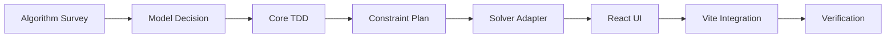

# Math.random 推測アプリ 実装ロードマップ

本書は `Math.random()` 推測・検証ツールを実装するための全体の流れをまとめる。今回のドキュメント制作フェーズでは実装に入らず、次フェーズ以降で何をどの順序で作るかを固定する。

関連文書:

- [README.md](./README.md): アプリの目的とユーザー向け概要
- [SPEC.md](./SPEC.md): 製品仕様、画面構成、入出力、制約
- [IMPLEMENTATION_NOTES.md](./IMPLEMENTATION_NOTES.md): Z3、ブラウザ実行、TDD 方針の技術メモ
- [ALGORITHM_SURVEY.md](./ALGORITHM_SURVEY.md): 各エンジンの `Math.random()` 実装調査

## 実装しないこと

この文書はロードマップであり、このフェーズでは次を行わない。

- React UI 実装
- Vite エントリ登録
- `z3-solver` 依存追加
- solver adapter 実装
- PRNG core 実装
- GitHub Pages / COOP / COEP 設定変更

## 全体フロー



## フェーズ 0: アルゴリズム調査

目的:

- Node.js / Chrome / Edge / Firefox / Safari の `Math.random()` 実装を、ソース・revision・バージョン範囲付きで整理する。
- 時期差・実装差・JIT path 差・cache/LIFO 差がある場合、別アルゴリズム ID として扱う判断材料を作る。
- 初版実装対象を決める。

成果物:

- [ALGORITHM_SURVEY.md](./ALGORITHM_SURVEY.md)
- 実装対象候補のアルゴリズム ID 一覧
- 未確認事項リスト

完了条件:

- `v8-current` の参照ソース、状態遷移、出力変換、観測順が説明できる。
- `v8-legacy-*`、`spidermonkey-current`、`javascriptcore-current` で未確認点が明示されている。
- 初版は最新の主要 Node.js / Chromium 系 V8 を優先する判断が文書化されている。

## フェーズ 1: exact モデル固定

目的:

- 初版の exact モデルを `v8-current` として固定する。
- 参照する V8 revision、Node.js version、Chrome / Chromium version、出力変換、cache 有無を model metadata に落とせる形にする。

作業:

1. `node --random_seed=1337` などで 70 件以上の実測ベクトルを取得する。
2. `process.version` と `process.versions.v8` を実測ベクトルに添える。
3. 64 件境界をまたぐ系列で、cache/LIFO reverse が不要か必要かを確認する。
4. Chromium / Chrome / Edge でも同じ形式の系列を採取する。
5. Node と Chromium で差があれば `v8-node-current` / `v8-chromium-current` に分ける。

成果物:

- `v8-current` model metadata
- 固定 seed 検証ベクトル
- 64 件境界の順序検証結果

## フェーズ 2: core TDD

t-wada 流に、小さい Red-Green-Refactor のサイクルで solver 非依存の純粋関数から作る。Web UI や Z3 を先に作らない。

対象:

- PRNG model
  - `nextState`
  - `toMathRandomNumber`
  - `floorRandom`
  - cache / 観測順正規化
  - model metadata
- 観測値パーサ
  - 生系列の 10 進文字列を JS `Number` に parse
  - `Number.prototype.toString()` で round-trip できる値の扱い
  - `[0, 1)` の範囲外エラー
  - 変換系列の `N` と `0..N-1` 検証
- 理論値計算
  - 状態サイズ
  - 1 観測あたりの情報量
  - 残り不確実性 bit
  - 推定残り観測数
- 制約生成
  - solver を呼ばず、観測からどの制約を作るかをデータ構造としてテストする

テスト方針:

- 既存の [lcg-predictor](../lcg-predictor) と同様に `*.spec.ts` をコロケーションする。
- まず `domain/` の純粋関数を Jest node 環境でテストする。
- 乱数実装ごとの差分は fixture と model metadata で表現する。
- `v8-current` と `v8-legacy-*` を同じ関数のフラグで分岐しすぎない。差分が大きい場合は別 model object にする。

## フェーズ 3: Z3 SolverAdapter

Z3 は UI や domain から直接呼ばない。`ConstraintPlan` を入力し、推論結果を返す `SolverAdapter` を境界にする。

方針:

- Node テストでは `z3-solver/node` を使う。
- ブラウザ実装では `z3-solver/browser` を worker 側に閉じ込める。
- Z3Guide の JavaScript API 方針に従い、xorshift128+ は 64-bit `BitVec` で表現する。
- `sat` / `unsat` / `unknown` をアプリの推論状態へ変換する。
- timeout 時は「候補あり・一意性未確認」などの部分状態を返せる形にする。

候補列挙:

1. solver に観測制約を追加する。
2. `check()` が `sat` なら model から state pair を取り出す。
3. 取り出した state pair を除外する blocking clause を追加する。
4. 上限件数または timeout まで繰り返す。
5. 2 件目が見つからなければ一意、2 件以上なら候補複数とする。

戻り値に含める情報:

- 推論状態
- 候補数
- 候補一覧の先頭 N 件
- 一意性確認の完了 / 未完了
- timeout の有無
- solver unavailable の理由
- 次値予測可能か

## フェーズ 4: UI 実装

UI は [SPEC.md](./SPEC.md) の完成形に沿う。初版は数値・テキスト中心で、グラフは作らない。

主要領域:

- ヘッダと説明
- 推論 / デモの 2 タブ
- 設定
  - 観測系列種別: 生系列 / 変換系列
  - `N`
  - 利用アルゴリズム
  - 逐次推論 ON / OFF
  - デモのみ生成源
- 観測入力
  - 貼り付け
  - カンマ / 空白 / 改行区切り
  - 1 件追加
  - 編集 / 削除 / 全クリア
- 絞り込み状況パネル
  - 実推論候補数
  - 理論候補数
  - 残り不確実性
  - 信頼度
  - 整合観測数
  - 推定残り観測数
  - 推論状態
  - 更新ソース
- 詳細
  - 候補一覧
  - 次値予測
  - デモの正解状態
  - ログ
  - モデル説明カード

状態管理:

- 初版は `lcg-predictor` に近い `useState` 中心でよい。
- 状態が肥大化した場合のみ Jotai を採用する。
- Jotai を採用する場合は、リポジトリのルールどおり atom 本体をコンポーネントから直接 import しない。

## フェーズ 5: Vite / リポジトリ統合

作業:

- `src/math-random-predictor/index.html`
- `src/math-random-predictor/main.tsx`
- `src/math-random-predictor/App.tsx`
- `vite.config.ts` の MPA input 追加
- `src/index.html` の目次リンク追加
- ルート `README.md` のプロジェクト一覧追加

注意:

- 今回のドキュメント制作フェーズでは上記は実施しない。
- Z3 browser 実行に COOP / COEP が必要な場合、Vite dev server headers と GitHub Pages の扱いを別途設計する。

## フェーズ 6: ブラウザ solver 実行

`z3-solver` は SharedArrayBuffer / worker / cross-origin isolation の制約を受ける。

方針:

- UI thread では重い solver を実行しない。
- worker で `z3-solver/browser` を初期化する。
- `crossOriginIsolated` が false の場合は精密推論を unavailable として表示する。
- GitHub Pages では任意 HTTP header を直接設定しにくいため、初版では solver unavailable 表示を主案にする。
- `coi-serviceworker` や headers 設定可能な配信先は後続検討にする。

## フェーズ 7: 検証

実装フェーズでは、少なくとも次を実行する。

```bash
npm test -- math-random-predictor
npm run check
npm run build
```

検証観点:

- `v8-current` の固定 seed ベクトルに一致する。
- 64 件境界で観測順が崩れない。
- 不正入力が仕様どおりエラーになる。
- solver timeout が UI 状態に反映される。
- SharedArrayBuffer 不可環境で solver unavailable 表示になる。
- 推論モードとデモモードで同じ core を使う。

## 初版スコープ

初版で狙うもの:

- `v8-current`
- 生系列の厳密観測値
- 理論値計算
- Node 環境の solver adapter
- ブラウザでは solver unavailable を明示できる UI
- モデル説明カード

初版では見送るもの:

- 生系列と変換系列の同時比較
- 丸め・表示桁不足の区間制約
- SpiderMonkey / JavaScriptCore の精密 solver
- `v8-legacy-*` の精密 solver
- グラフ表示
- ファイル import / export

## 実装前チェックリスト

- [ ] `ALGORITHM_SURVEY.md` の未確認事項を見直した
- [ ] `v8-current` の参照 V8 revision を固定した
- [ ] Node.js の固定 seed ベクトルを保存した
- [ ] 64 件境界の順序検証を完了した
- [ ] model metadata に出力変換と cache 有無を記録した
- [ ] `v8-legacy-*` を初版に混ぜない判断を確認した
- [ ] Z3 adapter の戻り値型を決めた
- [ ] UI で solver unavailable を表示する文言を決めた

## リスク

- ブラウザや Node.js の V8 revision 差で `v8-current` が 1 つにまとまらない可能性がある。
- 旧 V8 の cache/LIFO を現行 V8 と混同すると、観測順の制約が誤る。
- JavaScriptCore は JIT path 差分がありうるため、`WeakRandom` だけを見て exact と断定しない。
- SpiderMonkey / JavaScriptCore は固定 seed の実測が難しい可能性がある。
- GitHub Pages で Z3 browser 実行に必要な isolation header を付けられない可能性がある。

## 参考リンク

- [Z3 JavaScript API documentation](https://z3prover.github.io/api/html/js/index.html)
- [Z3 JavaScript examples in Z3Guide](https://microsoft.github.io/z3guide/programming/Z3%20JavaScript%20Examples/)
- [PwnFunction/v8-randomness-predictor](https://github.com/PwnFunction/v8-randomness-predictor)
- [V8 Math.random blog](https://v8.dev/blog/math-random)
- [V8 math.tq](https://github.com/v8/v8/blob/main/src/builtins/math.tq)
- [V8 random-number-generator.h](https://github.com/v8/v8/blob/main/src/base/utils/random-number-generator.h)
- [V8 math-random.cc](https://github.com/v8/v8/blob/main/src/numbers/math-random.cc)
- [SpiderMonkey jsmath.cpp](https://searchfox.org/mozilla-central/source/js/src/jsmath.cpp)
- [SpiderMonkey XorShift128PlusRNG.h](https://searchfox.org/mozilla-central/source/mfbt/XorShift128PlusRNG.h)
- [JavaScriptCore WeakRandom.h](https://github.com/WebKit/WebKit/blob/main/Source/WTF/wtf/WeakRandom.h)
- [JavaScriptCore MathObject.cpp](https://github.com/WebKit/WebKit/blob/main/Source/JavaScriptCore/runtime/MathObject.cpp)
